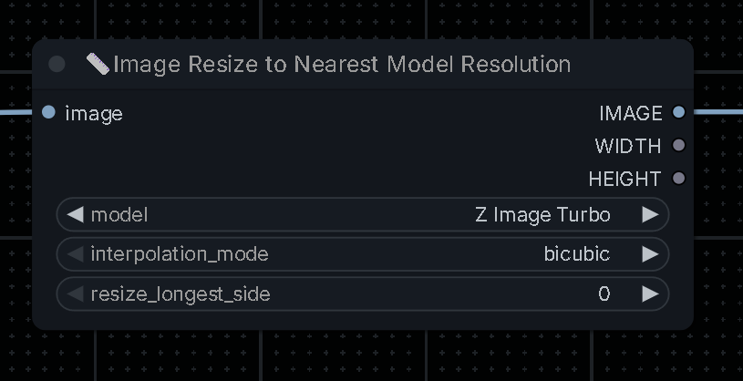
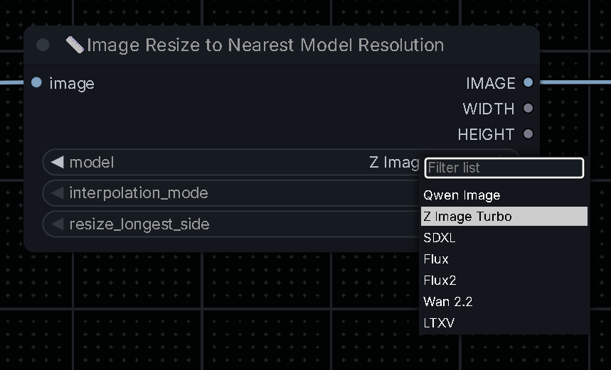
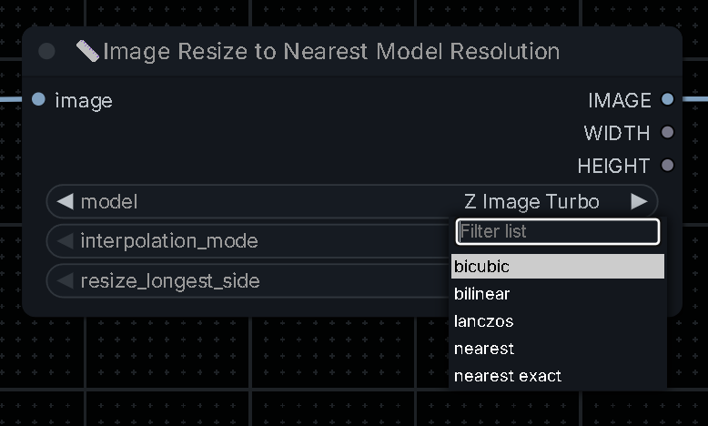

# comfyui-image-resize-to-model-resolution
This repo contains a custom node which resizes an imput image to a resolution on which the selected model is trained. 

# LibraryFinder

Most img2img workflows resize the input image before using it as a latent. It is highly recommended for optimal quality and performance to resize the input image to resolutions on which the model was trained.

The Image Resize to Nearest Model Resolution custom node takes as input a single image and allows you to choose the interpolation method for resizing and a target model. The node resizes the input image to the closest resolution on which your selected model was trained.

## Preview







## Installation

### Manual
1. Clone this repo into your `ComfyUI/custom_nodes/` folder:
```bash
git clone https://github.com/RiverSide71/comfyui-image-resize-to-model-resolution
```

2. Restart ComfyUI
  
**Known limitations**:
  - Please leave a comment and let me know.